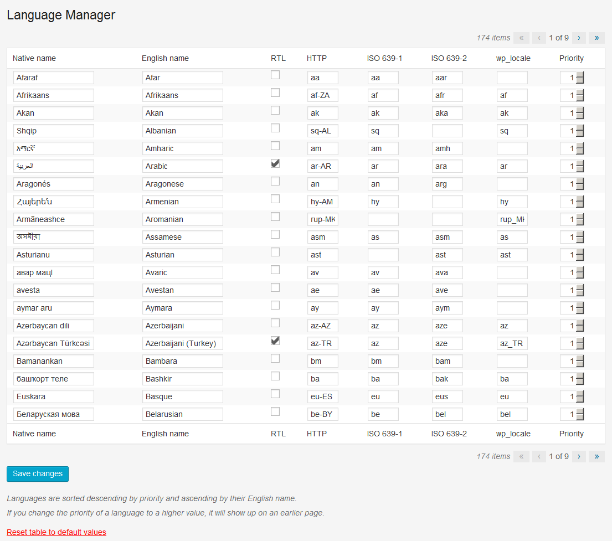
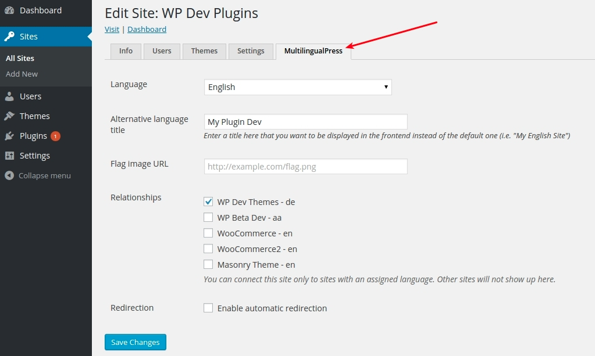
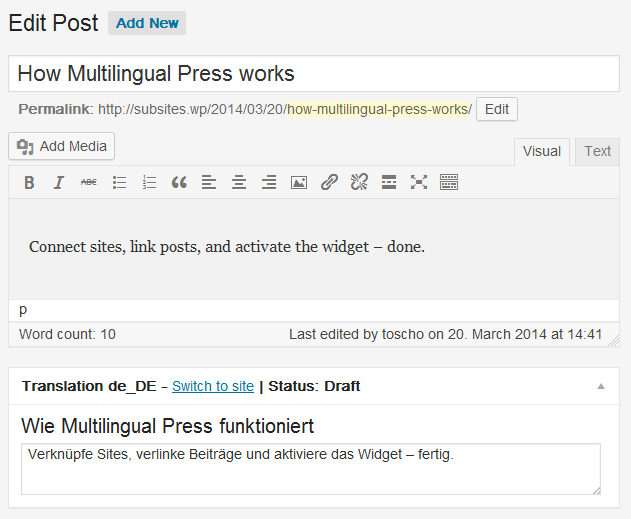
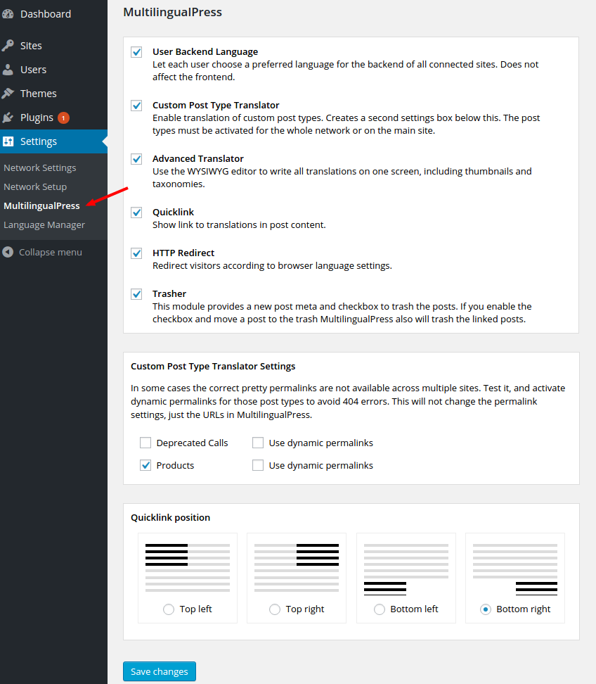
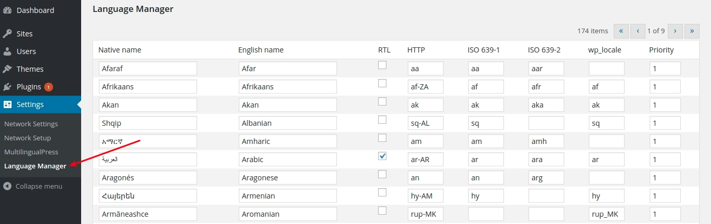
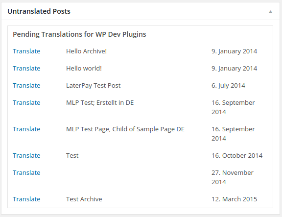
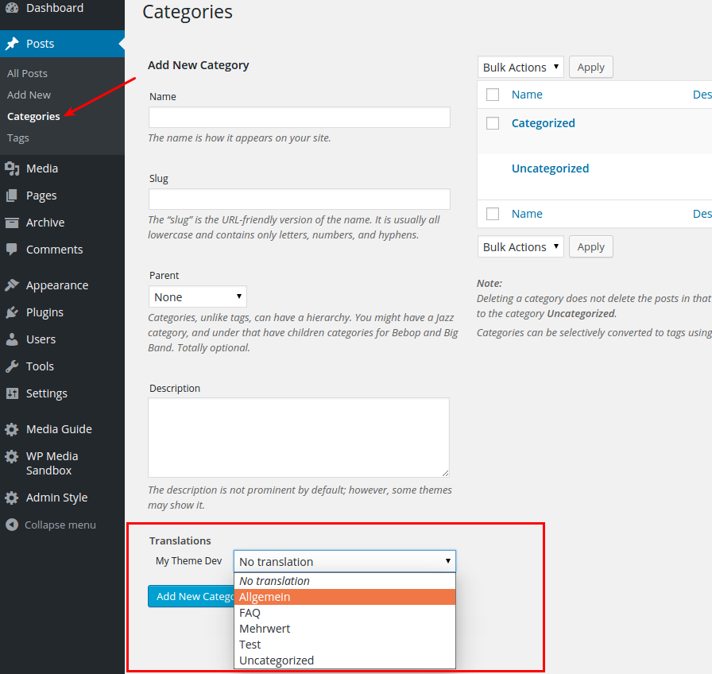
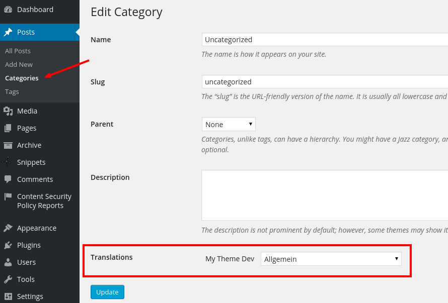
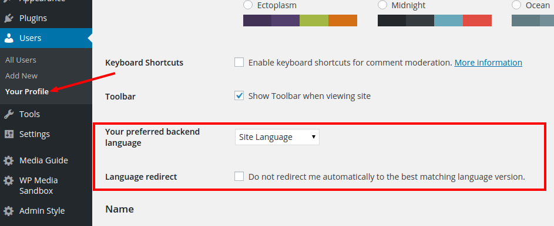
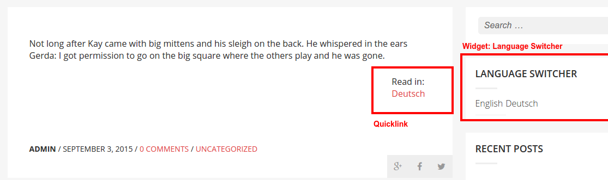

# MultilingualPress

Create a fast translation network on WordPress multisite.

## Description

Run each language in a separate site, and connect the content in a lightweight user interface. Use a customizable widget
to link to all sites.

This plugin lets you connect an unlimited amount of sites with each other.
Set a main language for each site, create relationships (connections), and start writing. You get a new field now to
create a linked post on all the connected sites automatically.
They are accessible via the post/page editor screen - you can switch back and forth to translate them.

In contrast to most other translation plugins there is **no lock-in effect**: When you disable our plugin, all sites
will still work as separate sites without any data-loss or garbage output.

Our **Language Manager** offers 174 languages, and you can edit them.

We cannot guarantee free ad hoc support. Please be patient, we are a small team.
You can follow our progress and development notices on our
[developer blog](http://make.marketpress.com/multilingualpress/).

## Features

- Set up unlimited site relationships in the site manager.
- Language Manager with 174 editable languages.
- Edit all translations for a post from the original post editor without the need to switch sites.
- Show a list of links for all translations on each page in a flexible widget.
- Translate posts, pages and taxonomy terms like categories or tags.
- Add translation links to any nav menu.
- No lock-in: After deactivation, all sites will still work.
- SEO-friendly URLs and permalinks.
- Support for top-level domains per language (via multisite domain mapping).
- Automatic `hreflang` support.
- Support for custom post types.
- Automatically redirect to the user's preferred language version of a post.
- Duplicate sites. Use one site as template for new site, copy *everything:* Posts, attachments, settings for plugins
and themes, navigation menus, categories, tags and custom taxonomies.
- Synchronized trash: move all connected post to trash with one click.
- Change relationships between translations or connect existing posts.
- Quicklinks. Add links to language alternatives to a post automatically to the post content. This is especially useful
when you don't use widgets or a sidebar.
- User specific language settings for the back-end. Every user can choose a preferred language for the user interface
without affecting the output of the front-end.
- Show posts with incomplete translations in a dashboard widget.

## Premium Support

We also offer [premium support](http://marketpress.com/product/multilingual-press-pro/) to save your time.
You get direct help from the developers of the plugin-and support the development.

## WPML to MultilingualPress

If you would like to switch from the WPML plugin to MultilingualPress, you can use the helping hands of
[WPML to MultilingualPress](https://wordpress.org/plugins/wpml-to-multilingualpress/). This plugin converts posts from
an existing WPML multilingual site via XLIFF export/import for MultilingualPress.

## Installation and prerequisites

### Requirements

* WordPress Multisite 4.0+.
* PHP 5.2.4, newer PHP versions will work faster.

### Installation

Use the installer via back-end of your install or ...

1. Unpack the download-package.
2. Upload the files to the `/wp-content/plugins/` directory.
3. Activate the plugin through the **Network/Plugins** menu in WordPress and click **Network Activate**.
4. Go to **All Sites**, **Edit** each site, then select the tab **MultilingualPress** to configure the settings. You
need at least two sites with an assigned language.

## Frequently Asked Questions

### Will MultilingualPress translate my content?

No, it will not. It manages relationships between sites and translations, but it doesn't change the content.

### Where can I get additional language files?

You can find all official translation files in the according
[GlotPress project](http://translate.marketpress.com/projects/plugins/multilingualpress).

### Can I use MultilingualPress on a single-site installation?

That would require changes to the way WordPress stores post content. Other plugins do that; we think this is wrong,
because it creates a lock-in: you would lose access to your content after the plugin deactivation.

## Screenshots

  
New columns in the site list table for the _Relationships_ (i.e., connections with other sites) and the _Site Language_.

  
New settings tab on the _Edit Site_ page.

  
New settings tab on the _Add New Site_ page.

  
Plugin settings, including Custom Post Type translation.

  
The _Language Manager_.

  
Dashboard widget informing about currently untranslated posts.

  
Translate a post directly from the _Edit Post_ page, and set the translation status and _Trasher_ setting.

  
Translate a term directly from the _Add New Category_ page.

  
Edit term translations on the _Edit Category_ page.

  
New user settings for the sitewide _Backend Language_ and the _Language Redirect_.

  
New _Language Switcher_ widget.

  
Frontend view of a post showing both the _Quicklinks_ and the _Language Switcher_ widget.

## Changelog

[Changelog](CHANGELOG.md)

## Other Notes
###Crafted by [Inpsyde](http://inpsyde.com) · Engineering the web since 2006.###
Yes, we also run that [marketplace for premium WordPress plugins and themes](http://marketpress.com).

### License
Good news, this plugin is free for everyone! Since it's released under the GPL, 
you can use it free of charge on your personal or commercial blog.
